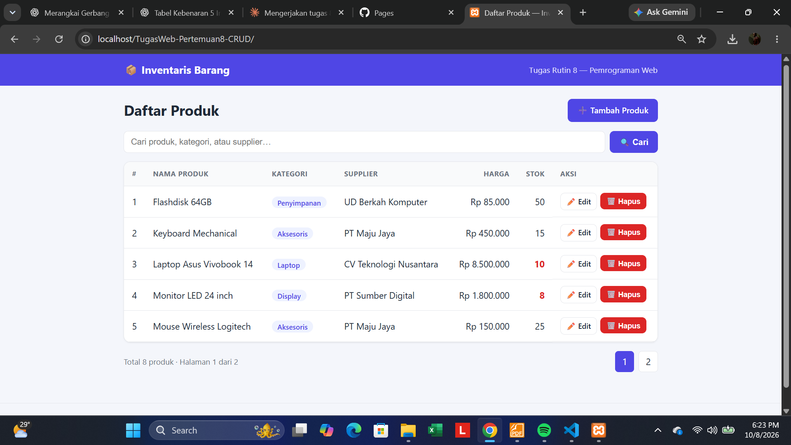
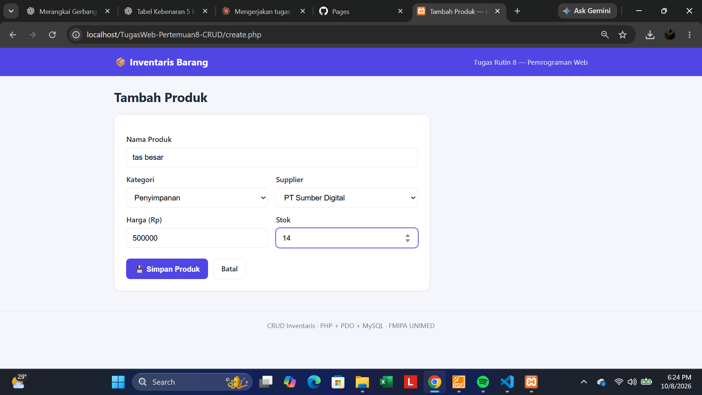
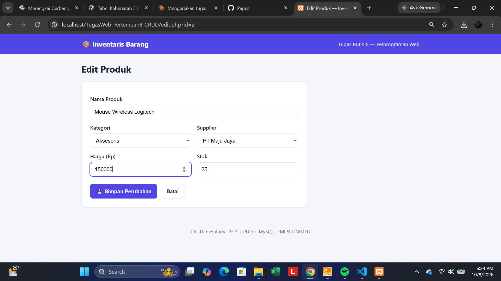
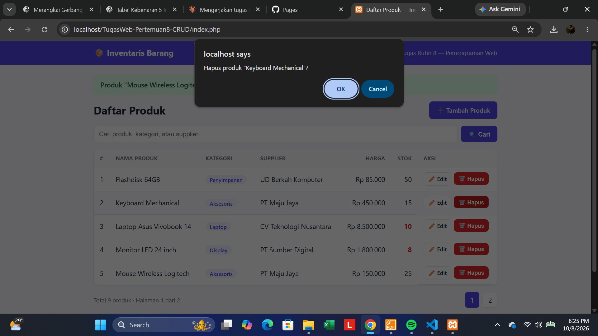

# TugasWeb-Pertemuan8-CRUD — CRUD Inventaris

Tugas Rutin 8 · Pemrograman Web (3KOM40115) · FMIPA UNIMED
Aplikasi CRUD inventaris barang dengan **PHP native + PDO + MySQL**.

## Fitur
- **Create** — form tambah produk (dropdown kategori & supplier)
- **Read** — daftar produk dengan `JOIN` 3 tabel, **pencarian** & **pagination** (bonus)
- **Update** — form edit ter-isi data lama (pre-filled)
- **Delete** — konfirmasi + **transaction** (hapus produk + catat `activity_logs`) (bonus)
- Flash message sukses/gagal dengan pola Post/Redirect/Get

## Keamanan
- Semua query yang memakai input user menggunakan **prepared statements** (`prepare()` + `execute()`)
- `PDO::ATTR_EMULATE_PREPARES = false` (real prepared statement), `ERRMODE_EXCEPTION`, `FETCH_ASSOC`
- Casting tipe `(int)` / `(float)` + validasi input
- Semua output HTML memakai `htmlspecialchars()` (fungsi `e()`)
- Token **CSRF** pada semua form POST (termasuk hapus)
- Error detail hanya ke `error_log()`, user hanya melihat pesan generik

## Desain Database (3NF)
```
categories (id PK, name)            1 ──< ∞   products
suppliers  (id PK, name, phone)     1 ──< ∞   products
products   (id PK, name, category_id FK, supplier_id FK, price, stock, created_at)
activity_logs (id PK, action, product_id, product_name, created_at)   -- bonus
```
Relasi *One-to-Many*: FK berada di sisi "many" (`products`). Seed data: ≥ 5 baris per tabel.

## Langkah Instalasi / Import Database
1. Install **Laragon** atau **XAMPP**, jalankan **Apache** & **MySQL**.
2. Salin folder proyek ini ke `htdocs/` (XAMPP) atau `www/` (Laragon).
3. Import database — pilih salah satu:
   - **phpMyAdmin**: buka `http://localhost/phpmyadmin` → tab **Import** → pilih `schema.sql` → **Go**.
   - **Terminal**: `mysql -u root -p < schema.sql`
4. Cek kredensial di `config/database.php` (default: host `localhost`, user `root`, password kosong).
   Bisa di-override dengan env var `DB_HOST`, `DB_NAME`, `DB_USER`, `DB_PASS`.
5. Buka `http://localhost/TugasWeb-Pertemuan8-CRUD/` di browser.

> Kebutuhan: PHP ≥ 7.4, ekstensi `pdo_mysql`, MySQL/MariaDB.

## Struktur Proyek
```
TugasWeb-Pertemuan8-CRUD/
├── config/
│   ├── database.php      # Singleton PDO
│   └── helpers.php       # e(), flash, CSRF, rupiah()
├── includes/
│   ├── header.php  footer.php
│   ├── product_form.php  # partial form (create & edit)
│   └── validate.php
├── assets/style.css
├── screenshots/          # taruh screenshot aplikasi di sini
├── schema.sql            # DDL + seed
├── index.php             # READ
├── create.php            # CREATE
├── edit.php              # UPDATE
└── delete.php            # DELETE (transaction)
```

## Screenshot
> Tambahkan screenshot setelah aplikasi dijalankan (simpan di folder `screenshots/`):

| Daftar Produk | Tambah Produk |
|---|---|
|  |  |

| Edit Produk | Hapus / Flash Message |
|---|---|
|  |  |

---
Dibuat oleh: **<MUHAMMAD HAFAZ BAIHAQI> — <4253550001>**
